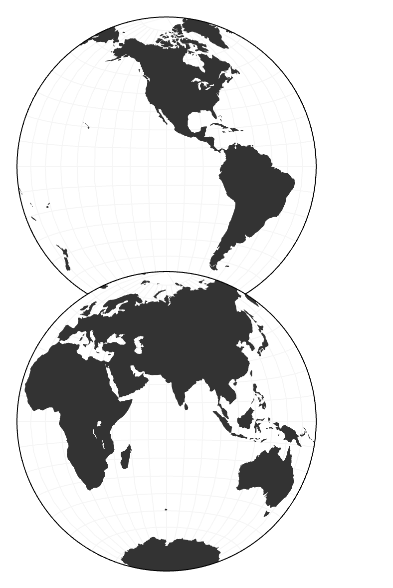

# d3-geo-hemispheres

A map projection compatible with [d3-geo](https://d3js.org/d3-geo) for drawing a vertical world map.

## Installing

If you use NPM, `npm install d3-geo-hemispheres`. Otherwise, download the [latest release](https://github.com/HarryStevens/d3-geo-hemispheres/raw/master/build/d3-geo-hemispheres.zip).

```js
import { geoHemispheres } from "d3-geo-hemispheres"

const projection = geoHemispheres();
```

## API Reference

The projection works like a [d3-geo projection](https://d3js.org/d3-geo/projection) with exceptions noted below.

<a name="geoHemispheres" href="#geoHemispheres">#</a> d3.<b>geoHemispheres</b>(<i>raw</i>) · [Source](https://github.com/HarryStevens/d3-geo-hemispheres/blob/master/src/index.js)



The stacked hemispheres projection with <i>overlap</i> of 0.15 and <i>rotate</i> of [110, 0, 0].

You can pass a symmetrical [<i>raw</i> projection](https://d3js.org/d3-geo/projection#raw-projections), such as d3.geoAzimuthalEqualAreaRaw, d3.geoAzimuthalEquidistantRaw, d3.geoOrthographicRaw, d3.geoStereographicRaw or [d3.geoCrasterRaw](https://github.com/d3/d3-geo-projection?tab=readme-ov-file#geoCrasterRaw).

<a name="hemispheres_overlap" href="#hemispheres_overlap">#</a> <i>hemispheres</i>.<b>overlap</b>([<i>overlap</i>])

If <i>overlap</i> is specified, sets the share of the top hemisphere that is covered by the bottom hemisphere. An overlap of 0 means the two hemispheres do not overlap, while an overlap of 1 means the bottom hemisphere covers the top. If <i>overlap</i> is not specified, returns the current overlap, which defaults to 0.15.

<a name="hemispheres_width" href="#hemispheres_width">#</a> <i>hemispheres</i>.<b>width</b>([<i>width</i>])

If <i>width</i> is specified, sets the width of the map. If <i>width</i> is not specified, returns the current width, which defaulst to 100.

You should calculate the height with:

```js
const height = projection.width() * (2 - projection.overlap());
```